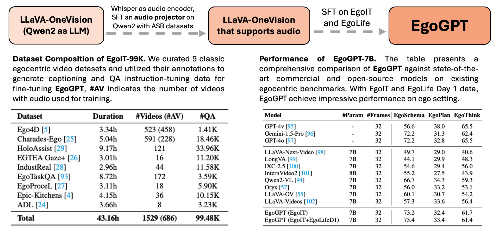

# 🤖🧠 EgoGPT:
[](https://egolife-ai.github.io/)  &nbsp;&nbsp;&nbsp;  [](https://egolife-ai.github.io/blog/)  &nbsp;&nbsp;&nbsp;  [](https://egolife.lmms-lab.com/)  &nbsp;&nbsp;&nbsp;  [](https://huggingface.co/collections/lmms-lab/egolife-67c04574c2a9b64ab312c342)  &nbsp;&nbsp;&nbsp;  [](https://huggingface.co/collections/lmms-lab/egolife-67c04574c2a9b64ab312c342)


## 📢 News

- 🚀[2025/2/28] EgoGPT codebase is released!

## Introduction

|  |
|:---|
| <p align="justify"><b>Figure 1. The Overview of EgoGPT Project.</b> EgoGPT is an omni-modal model trained on egocentric datasets, achieving state-of-the-art performance on egocentric video understanding. The left above illustrates the progression from LLaVA-OneVision (Qwen2 as the LLM) to an audio-supported variant by integrating Whisper as an audio encoder and fine-tuning an audio projector with ASR datasets. The final EgoGPT model is trained using SFT on EgoIT and EgoLife datasets. The left table presents the Dataset Composition of EgoIT-99K, summarizing nine egocentric video datasets used for instruction tuning, including the total duration, number of videos, and question-answer pairs. The right table reports the Performance of EgoGPT-7B, comparing it against state-of-the-art commercial and open-source models across three egocentric benchmarks: EgoSchema, EgoPlan, and EgoThink. The results indicate that EgoGPT, trained on EgoIT and EgoLife Day 1, achieves strong performance in egocentric reasoning tasks.
</p>


## Installation

1. Clone this repository.

```shell
git clone https://github.com/egolife-ntu/EgoLife
cd EgoLife/EgoGPT
```

2. Install the dependencies.

```shell
conda create -n egogpt python=3.10
conda activate egogpt
pip install --upgrade pip
pip install -e .

3. Install the dependencies for training and inference.

```shell
pip install -e ".[train]"
pip install flash-attn --no-build-isolation
```


## Quick Start

### Download & Setup

1. Download EgoGPT-7b from 🤗[EgoGPT](https://huggingface.co/collections/lmms-lab/egolife-67c04574c2a9b64ab312c342) and audio encoder from [Audio Encoder](https://huggingface.co/EgoGPT/speech_encoder).

2. Download EgoIT dataset from 🤗[Huggingface](https://huggingface.co/datasets/EgoGPT/EgoIT_Video) and construct the directory as follows:
```python
from huggingface_hub import snapshot_download
local_path = snapshot_download(
    repo_id="EgoGPT/EgoIT_Video", 
    repo_type="dataset", 
    local_dir="data"
)
```
```bash
data/ # The directory for videos and audio (keep the same as the huggingface dataset)
├── ADL/
│   ├── images/
│   ├── audio/
├── ChardesEgo/
│   ├── *.mp4/
│   ...

datasets/ # The directory for json
├── ADL/
│   ├── ADL.json
├── ChardesEgo/
│   ├── ChardesEgo.json
├── ...
├── EgoIT.json # The concatenated json for training
```

3. If you want to train EgoGPT from scratch(e.g from LLaVA-Onevision), please download the audio project from [here](https://github.com/egolife-ntu/EgoLife-Audio).

### Inference

```shell
python inference.py --pretrained_path checkpoints/EgoGPT-7b-EgoIT-EgoLife --video_path data/train/A1_JAKE/DAY1/DAY1_A1_JAKE_11223000.mp4 --audio_path audio/DAY1_A1_JAKE_11223000.mp3 --query "Please describe the video in detail."
```

### Demo
Run the following command to start the demo that identical to the [EgoGPT Demo](https://egolife.lmms-lab.com/).
```shell
python gradio_demo.py
```

### Training
Please replace the `DATA_PATH`, `MODEL_PATH`, `SPEECH_PROJECTOR_PATH` and `SPEECH_ENCODER_PATH` in the following command with your own paths.
```shell
bash scripts/train_egogpt.sh
```

### Evaluation
#### Setup
Our evaluation are conducted on lmms-eval. Please refers to the [lmms-eval](https://github.com/EvolvingLMMs-Lab/lmms-eval) repository for the evaluation setup.

#### Run
```shell
python3 -m accelerate.commands.launch \
    --main_process_port 10043 \
    --num_processes=8 \
    -m lmms_eval \
    --model egogpt \
    --model_args pretrained=YOUR_EGOGPT_MODEL_PATH, conv_template="qwen_1_5"\
    --tasks egoplan, egothink \
    --batch_size 1 \
    --log_samples \
    --output_path YOUR_OUTPUT_PATH
```

## LICENSE
Our code is released under the Apache-2.0 License.
## Acknowledgements

- [LLaVA](https://github.com/LLaVA-VL/LLaVA-NeXT): Our codebase is conducted on LLaVA.
- [lmms-eval](https://github.com/EvolvingLMMs-Lab/lmms-eval): Our evaluation system are built on lmms-eval.

## Citation

If our work is useful for you, please cite as:

```bibtex
@inproceedings{yang2025egolife,
  title={EgoLife: Towards Egocentric Life Assistant},
  author={Yang, Jingkang and Liu, Shuai and Guo, Hongming and Dong, Yuhao and Zhang, Xiamengwei and Zhang, Sicheng and Wang, Pengyun and Zhou, Zitang and Xie, Binzhu and Wang, Ziyue and Ouyang, Bei and Lin, Zhengyu and Cominelli, Marco and Cai, Zhongang and Zhang, Yuanhan and Zhang, Peiyuan and Hong, Fangzhou and Widmer, Joerg and Gringoli, Francesco and Yang, Lei and Li, Bo and Liu, Ziwei},
  booktitle={The IEEE/CVF Conference on Computer Vision and Pattern Recognition},
  year={2025},
}
```
