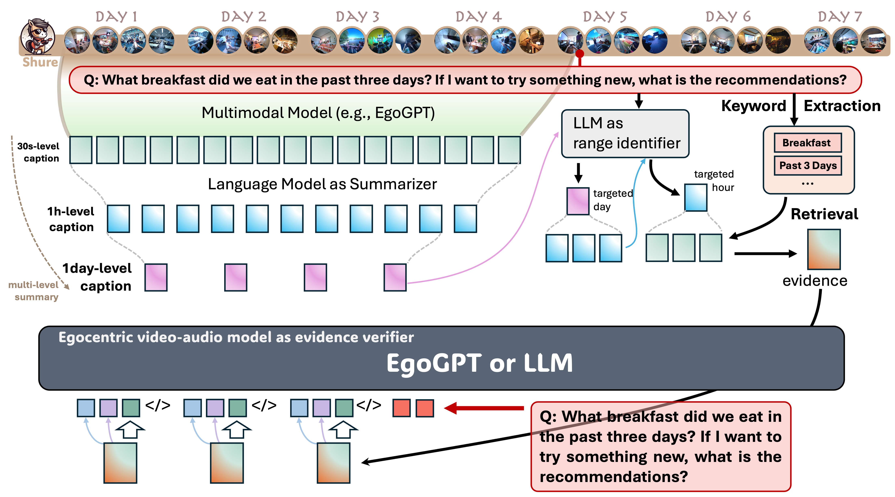

# EgoRAG

EgoRAG is a retrieval-augmented generation (RAG) system that enhances memory and query capabilities, enabling personalized and long-term comprehension.

|  |
|:---|
| <p align="justify"><b>Figure 1. The Overview of EgoRAG Project.</b> A schematic representation of the EgoRAG system that processes user queries through a multi-stage pipeline: First, it identifies relevant time ranges using multi-level summarization. Then, it retrieves pertinent video segments based on those time ranges. Finally, it gathers multiple pieces of evidence which are fed into an answering model (e.g., EgoGPT) to generate comprehensive responses to user queries.
</p>

## Installation

To install EgoRAG, make sure you are in the `EgoRAG` directory and run the following commands:

```bash
pip install -e .
```

This will install the package in editable mode, allowing you to make changes to the code without needing to reinstall it.


### Downloading the Dataset

#### Video Files
1. Access the video files at: [EgoLife Dataset](https://huggingface.co/datasets/lmms-lab/EgoLife/tree/main)
2. Download and organize the videos in the following structure:
   ```
   path/to/EgoLife/
   └── train/
       ├── A1_JAKE/
       ├── A2_ALICE/
       ├── A3_TASHA/
       └── ...
   ```
3. Set `video_base_dir` in your commands to point to the `train` directory (e.g., `path/to/EgoLife/train`)

#### QA Annotations
1. Download the QA JSON file from: [EgoLife Dataset](https://huggingface.co/datasets/lmms-lab/EgoLife/tree/main)
2. When running the pipeline, set the `query_json` parameter to point to your downloaded QA file (e.g., `path/to/QA.json`)

### Data Format

#### Question Format
The QA annotations follow this format:
```json
{
    "ID": "1",
    "query_time": {
        "date": "DAY1",
        "time": "11210217"
    },
    "type": "EntityLog",
    "need_audio": false,
    "need_name": true,
    "last_time": false,
    "trigger": "The table was filled with various tools and parts",
    "question": "Who used the screwdriver first?",
    "choice_a": "Tasha",
    "choice_b": "Alice",
    "choice_c": "Shure",
    "choice_d": "Lucia",
    "answer": "B",
    "target_time": {
        "date": "DAY1",
        "time": "11152408"
    },
    "keywords": "use screwdriver",
    "reason": "Saw Alice tightening screws with a screwdriver"
}
```

The required fields are: `query_time`, `question`, `choice_[a-d]`, and `keywords`.

### API Key Setup

Before running the pipeline, you need to set up API keys and endpoints for GPT and DeepSeek services. Configure the following environment variables:

1. For DeepSeek services:

Using Azure:
```bash
export AZURE_DEEPSEEK_KEY="your_deepseek_api_key"
export AZURE_DEEPSEEK_ENDPOINT="your_deepseek_endpoint"
export DEPLOYMENT_NAME="DeepSeek-R1"  # Optional
```

Using Official API:
```bash
export DEEPSEEK_API_KEY="your_deepseek_api_key"
export DEPLOYMENT_NAME="DeepSeek-R1"  # Optional
```

2. For GPT services:

Using Azure:
```bash
export AZURE_API_KEY="your_gpt_api_key"
export AZURE_API_ENDPOINT="your_gpt_endpoint"
```

Using OpenAI:
```bash
export OPENAI_API_KEY="your_gpt_api_key"
```

## Usage

### Creating the Database

There are two methods to create a database for querying and answering questions:

#### Method 1: Create from JSON (Fast)

If you have captions for each video, you can gather them into a single JSON file and generate the database. The JSON should follow this format:

```json
{
    "start_time": "11100000",
    "end_time": "11103000",
    "text": "<model caption>",
    "date": "DAY1",
    "video_path": "EgoLife/train/A1_JAKE/DAY1_A1_JAKE_11100000.mp4"
}
```

To create the database, run:

```bash
python3 create_database.py --db_name "DB_NAME" --json_path "/path/to/your/database.json"
```

This will generate the database `<DB_NAME>`.

#### Method 2: Create from Video (Slow)

In this method, the model will go through all the videos, extract captions, and add them to the database one by one. Use the following command to create the database:

```bash
python3 main.py \
    --name "A1_JAKE" \  # Available options: A1_JAKE, A2_ALICE, A3_TASHA, etc.
    --db_name "DB_NAME" \
    --stage create \
    --video_dir "path/to/EgoLife/train" \
    --config "configs/model_config.yaml"
```

### Running the Pipeline

#### Query Only
To query the database:
```bash
python3 main.py \
    --name "A1_JAKE" \
    --db_name "DB_NAME" \
    --stage query \
    --video_dir "path/to/EgoLife/train" \
    --config "configs/model_config.yaml" \
    --query_json "path/to/QA.json"
```

#### Answer Only
To process query results:
```bash
python3 main.py \
    --name "A1_JAKE" \
    --db_name "DB_NAME" \
    --stage answer \
    --video_dir "path/to/EgoLife/train" \
    --config "configs/model_config.yaml" \
    --query_json "path/to/QA.json" \
    --query_result_json "path/to/query/result.json"
```

#### Combined Pipeline
Run query and answer stages together:
```bash
python3 main.py \
    --name "A1_JAKE" \
    --db_name "DB_NAME" \
    --stage query answer \
    --video_dir "path/to/EgoLife/train" \
    --config "configs/model_config.yaml" \
    --query_json "path/to/QA.json"
```

Run all stages (create, query, and answer) at once:
```bash
python3 main.py \
    --name "A1_JAKE" \
    --db_name "DB_NAME" \
    --stage create query answer \
    --video_dir "path/to/EgoLife/train" \
    --config "configs/model_config.yaml" \
    --query_json "path/to/QA.json"
```

