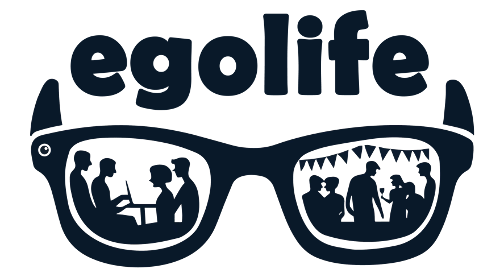

# The EgoLife Project

  
  &nbsp;&nbsp;&nbsp;
  
  &nbsp;&nbsp;&nbsp;
  
  &nbsp;&nbsp;&nbsp;
  <a href="https://github.com/Jingkang50/EgoLife" target='_blank'>
    
  

  </a>
  

## Introduction
Welcome to the EgoLife project, an open-research initiative aimed at collecting and sharing a unique **extreeemely-long**, **intercorrelated (both inter-personal and temporal)**, multi-modal egocentric video dataset. Our goal is to provide the research community with a valuable resource for studying human behavior, social interactions, and daily life from a first-person perspective. This dataset serves as a testbed to inspire and develop concepts surrounding egocentric AI assistants. The project is supported by SenseTime Research, and the Aria glasses used for data collection are provided by the Aria team.

|  |
|:--:|
| <b>Conceptual Figure for the EgoLife Dataset.</b> Used in project proposal.|

## Project Overview
EgoLife is considered as a multi-phase project. The core dataset, "EgoWeek" (EgoLife v1), featuring 6 volunteers living together in a shared house for 7 days, each wearing [a special egocentric camera](https://www.projectaria.com/) that captures their daily activities, interactions, and experiences. The collected data will include not only video but also audio, IMU, and other sensor data, creating a rich, multi-modal dataset.

In addition to EgoWeek, we plan to expand the EgoLife dataset with two more subsets:
- **EgoDay**: Special one-day recordings from multiple individuals, such as a group attending a Taylor Swift concert or watching a Chinese national football team not securing a win against Singapore.
- **EgoMonth**: Month-long daily recordings from the authors, capturing the mundane aspects of daily life.

In the EgoLife dataset, beyond the six synchronized egocentric videos, we will also reconstruct the entire 3D house. In the common areas, we will place 12 GoPro cameras to provide third-person view recordings and enable 3D human pose reconstruction. Our goal is to "reconstruct" a 7x24 long high-quality 3D video, benefiting not only egocentric vision research but also 3D computer vision.

## Open-Research Philosophy
We believe in the power of transparency and collaboration. That's why we're conducting this project as an open-research initiative. We'll be "live streaming" the data collection process, sharing regular updates, and engaging with the community throughout the project. We welcome your input, suggestions, and ideas to help shape the direction of EgoLife.

## Dataset Features
- **Long-term, Continuous Data**: Unlike many existing egocentric datasets, EgoLife will feature long, continuous recordings spanning multiple days, capturing the natural flow of daily life.
- **Focus on Intercorrelation**: By having multiple participants living together, EgoLife will capture the complex social interactions and inter-personal dynamics that shape our daily experiences.
- **Temporal Intercorrelation**: These recordings are purposeful. We establish a clear objective for our volunteers: to spend a week preparing for an Earth Day celebration for themselves and their invited guests. There is no predetermined script. Researchers on-site ensure that the captured life is natural and informative, with many events linked over time.
- **Multi-modal Data**: EgoLife will include not only video but also audio, IMU, and other sensor data, enabling researchers to study human behavior from multiple perspectives. We also include mmwave radar in our data collection pipeline.
- **Rich Annotations**: Alongside the raw sensor data, EgoLife will feature comprehensive annotations made by the participants, providing unique insights into their thoughts, feelings, and decision-making processes. Volunteers will extensively annotate their experiences, particularly focusing on their inner monologues and personal reflections.

## Timeline
- **April 14-21, 2024**: Data collection in the shared house
- **May 2024**: Data processing, annotation, and preparation for release
- **June-July 2024**: Initial dataset release to the research community
- **Ongoing**: Building models for extremely long multimodal videos. Regular updates, additional data releases, and community engagement

## Earth Day Celebration
Originally, we planned to organize the EgoWeek around Easter Sunday, with the volunteers using several days to prepare for an Easter party. However, to be more inclusive and respectful of all beliefs, we have shifted our focus to Earth Day. The volunteers will now spend their time in the shared house preparing for an Earth Day celebration, which will take place on the final day of the recording.

## Privacy and Ethics
We highly value and respect the privacy of our volunteers. All data collection and sharing will be conducted in strict accordance with IRB guidelines and GDPR regulations. Volunteers will have the opportunity to review and redact any sensitive information before the dataset is released, and all data will be anonymized to protect their identities.

## Get Involved
We want to hear from you! As an open-research project, we value your input and contributions. Here are some ways you can get involved:

- **Suggest Research Directions**: What research questions do you think EgoLife could help answer? Let us know, and we'll consider incorporating your ideas into our data collection and annotation process.
- **Propose New Features**: Is there a specific type of data or annotation you'd like to see included in EgoLife? Share your suggestions, and we'll do our best to accommodate them.
- **Collaborate with Us**: Are you interested in collaborating with us on the EgoLife project? We're open to partnerships with researchers, institutions, and industry partners who share our vision.

## Contact Us
If you have any questions, suggestions, or collaboration ideas, please don't hesitate to reach out to us at jingkang001@e.ntu.edu.sg or leave your comments in issue or discussion. We look forward to hearing from you and working together to advance the field of egocentric vision and human behavior understanding.

Let's make EgoLife a game-changing resource for the research community!
